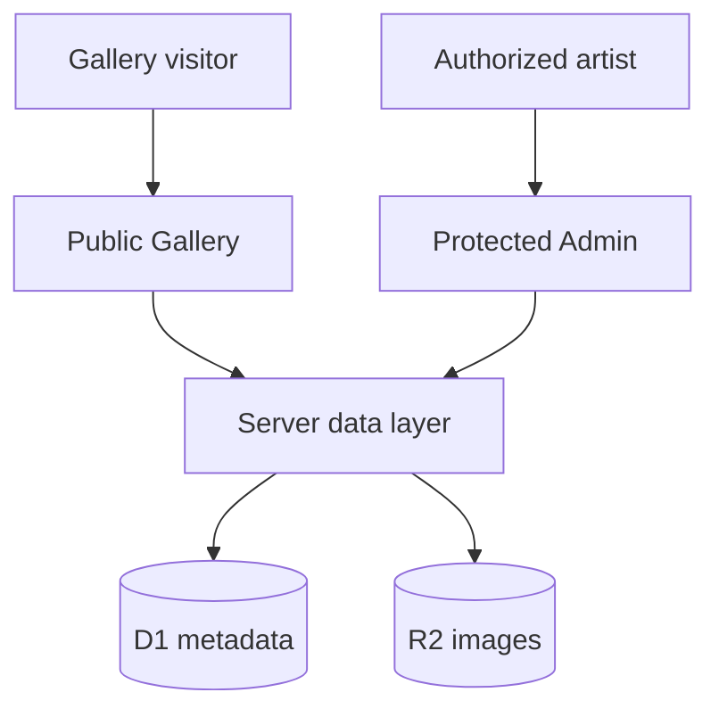

# Art and Photo Gallery — Proposed Design

## 1. Design goals

The solution contains two experiences within one application:

- **Gallery:** a public, image-focused artist portfolio.
- **Admin:** a protected content-management interface at `/admin`.

The design should keep the public presentation visually expressive while keeping administration practical, secure, and easy for the artist to use. Gallery data and uploaded images must survive deployments and must not require source-code editing.

## 2. Technology baseline

| Concern | Current / proposed technology |
|---|---|
| UI | React 19 with TypeScript |
| Application framework | Next.js-compatible Vinext |
| Rendering | Server-rendered routes with client React interactions where needed |
| Hosting | ChatGPT Sites, deployed to a Cloudflare Worker-compatible runtime |
| Authentication | ChatGPT sign-in managed by Sites dispatch |
| Authorization | Server-side administrator email allowlist; role model can be added later |
| Structured content | Cloudflare D1 SQL database — proposed |
| Image storage | Cloudflare R2 object storage — proposed |
| Schema tooling | Drizzle ORM and generated SQL migrations — proposed |

The Cloudflare runtime is an implementation choice of ChatGPT Sites. The React application is conceptually portable, but moving to another host would require replacements for Sites authentication, D1/R2 bindings, and deployment configuration.

## 3. System context



The browser never receives database or object-storage credentials. Public reads and all administrative writes go through server-side application code.

## 4. Application structure

Current source organization after the React structure refactor:

```text
src/
├── app/
│   ├── page.tsx                   # Thin Gallery route entry
│   ├── layout.tsx                 # Application document shell
│   ├── globals.css                # Gallery visual system
│   └── admin/page.tsx             # Protected Admin route entry
├── components/
│   ├── gallery/                   # Gallery sections and interactions
│   └── admin/                     # Admin dashboard and scoped styles
├── data/
│   └── sample-works.ts            # Temporary static content source
├── server/
│   └── auth/chatgpt.ts            # Server-only authentication helpers
└── types/
    └── gallery.ts                 # Shared Gallery domain types
db/
├── schema.ts                      # Future Drizzle schema
└── index.ts                       # Future database access
drizzle/                           # Generated and reviewed migrations
public/gallery/                    # Current static sample images
specs/
├── requirements.md
└── design.md
```

Planned Admin pages and API routes will be added under `src/app/admin` and
`src/app/api/admin`. Database repositories and R2 integration will live under
`src/server` so browser components cannot import infrastructure bindings by
accident. The first dynamic milestone can keep the Gallery on one route while
introducing server-backed data and a focused Add/Edit flow.

## 5. Public Gallery design

### 5.1 Rendering model

- Render published gallery content on the server for a fast initial response and search-engine visibility.
- Use React client components only for interactive behavior such as mobile navigation, category filtering, and the lightbox.
- Query only published, non-archived works for public routes.
- Order categories and works using explicit administrator-controlled sort values.
- Return optimized display images rather than full-resolution originals in gallery grids.

This is not a purely client-only SPA. It uses server rendering for page content and SPA-like React interaction after the page loads.

### 5.2 Gallery information hierarchy

1. Header and primary navigation.
2. Featured work and artist positioning statement.
3. Art categories and representative works.
4. Photography categories and representative works.
5. Links and artist information.
6. Optional availability indicators in a later commerce phase.

### 5.3 Image presentation

Each uploaded image should have at least:

- Original object retained privately or with controlled access.
- Large display variant for the lightbox.
- Medium display variant for gallery cards.
- Thumbnail variant for Admin and compact lists.

Image records should contain width, height, MIME type, byte size, alternative text, and R2 object keys. The database, not an inferred folder name, is the source of truth for the relationship between a work and its images.

### 5.4 Lightbox

- Load the large display variant on demand.
- Support previous/next navigation within the current filtered collection.
- Support Escape and arrow keys.
- Restore focus to the originating thumbnail when closed.
- Trap focus inside the open dialog.
- Avoid exposing a direct original-file download unless the artist chooses to allow it.

## 6. Admin design

### 6.1 Authentication and authorization

The current protection model is:

1. A request to `/admin` calls `requireChatGPTUser("/admin")` on the server.
2. Sites redirects an anonymous visitor through ChatGPT sign-in.
3. The application receives the authenticated user's forwarded identity.
4. The server compares the normalized email to `ADMIN_EMAILS`.
5. Only an allowlisted account receives the Admin page.

Every Admin API handler and server action must repeat authorization through a shared server-only guard. The UI check is never the security boundary.

Proposed shared guard:

```ts
async function requireAdministrator() {
  const user = await requireChatGPTUser("/admin");
  if (!isAllowlisted(user.email)) throw new ForbiddenError();
  return user;
}
```

If multiple editors are needed later, replace or supplement the environment allowlist with an `administrators` database table containing roles such as `owner` and `editor`. At least one bootstrap owner should remain configured outside ordinary Admin editing.

### 6.2 Collection dashboard

The Admin landing page should provide:

- Total, published, draft, archived, available, and sold counts as applicable.
- Search by title.
- Filters for type, category, status, year, and availability.
- Thumbnail-oriented table or grid.
- Quick publication-state changes.
- Direct Add Work action.
- Clear link to view the public gallery.

### 6.3 Add/Edit Work flow

Suggested workflow:

1. Choose Art or Photography.
2. Upload original image.
3. Enter required metadata: title, category, year, and alternative text.
4. Enter optional metadata: description, medium, dimensions, credit, and availability.
5. Select featured/category-cover state and display order if needed.
6. Save as draft.
7. Preview the public presentation.
8. Publish.

Validation should be performed both in the browser for usability and on the server for security and data integrity.

### 6.4 Upload flow

For the initial implementation, route uploads through a protected server endpoint:

1. Authenticate and authorize the administrator.
2. Validate file type, size, and file signature.
3. Generate a stable work/image identifier.
4. Write image objects to R2.
5. Create image metadata in D1.
6. Link the image to the work in the same logical operation.
7. If database creation fails, remove newly written orphaned objects when possible.

Large-file direct uploads through short-lived signed URLs can be considered later if server-proxied uploads become a performance constraint.

## 7. Proposed data model

### 7.1 `works`

| Column | Purpose |
|---|---|
| `id` | Stable generated identifier |
| `slug` | Public URL-friendly identifier, unique |
| `kind` | `art` or `photo` |
| `title` | Public title |
| `year` | Display year; text permits ranges or `undated` later |
| `description` | Public description |
| `medium` | Medium/material, mainly for art |
| `dimensions` | Human-readable dimensions |
| `category_id` | Category relationship |
| `status` | `draft`, `published`, or `archived` |
| `featured` | Featured-home flag |
| `sort_order` | Administrator-controlled ordering |
| `availability` | `not_for_sale`, `available`, `reserved`, or `sold` |
| `price_minor` | Optional integer price in the smallest currency unit |
| `currency` | Optional ISO currency code |
| `published_at` | Publication timestamp |
| `created_at` | Creation timestamp |
| `updated_at` | Last-update timestamp |

`price_minor` and `currency` remain unused until commerce is approved.

### 7.2 `categories`

| Column | Purpose |
|---|---|
| `id` | Stable identifier |
| `kind` | Limits category to Art or Photography |
| `name` | Display name |
| `slug` | Unique within its kind |
| `description` | Optional public description |
| `cover_work_id` | Optional representative work |
| `sort_order` | Navigation and display order |
| `active` | Whether the category is publicly visible |

### 7.3 `images`

| Column | Purpose |
|---|---|
| `id` | Stable identifier |
| `work_id` | Parent work |
| `role` | `primary`, `detail`, or another future role |
| `original_key` | R2 key for the uploaded original |
| `display_key` | R2 key for large display image |
| `card_key` | R2 key for gallery-card image |
| `thumbnail_key` | R2 key for Admin thumbnail |
| `alt_text` | Accessibility description |
| `mime_type` | Validated media type |
| `width`, `height` | Pixel dimensions |
| `byte_size` | Uploaded size |
| `sort_order` | Order for multiple images |
| `created_at` | Creation timestamp |

### 7.4 `site_content`

A small key/value or section-based table can store editable singleton content:

- Artist public name.
- Wordmark.
- Hero headline and introduction.
- Biography and artist statement.
- Contact email.
- Social/exhibition links.

For strong typing, a dedicated `artist_profile` table and `external_links` table are preferable if the content becomes more complex.

### 7.5 Audit information

At minimum, content records should store `created_at`, `updated_at`, and the authenticated editor email for the last write. A full immutable audit log can be added if multiple editors or commerce make it necessary.

## 8. Server endpoints

Proposed JSON endpoints or equivalent server actions:

| Method | Route | Purpose |
|---|---|---|
| `GET` | `/api/admin/works` | List works for Admin |
| `POST` | `/api/admin/works` | Create draft work |
| `GET` | `/api/admin/works/:id` | Load editable work |
| `PATCH` | `/api/admin/works/:id` | Update work metadata/status |
| `DELETE` | `/api/admin/works/:id` | Archive by default; permanent deletion separately controlled |
| `POST` | `/api/admin/works/:id/images` | Upload and attach image |
| `GET/POST/PATCH` | `/api/admin/categories` | Manage categories |
| `GET/PATCH` | `/api/admin/profile` | Manage artist information |
| `GET/POST/PATCH/DELETE` | `/api/admin/links` | Manage external links |

Public pages should generally read through server components or server-only repositories rather than exposing unnecessary generic public APIs.

## 9. Data integrity rules

- Slugs must be unique and stable after publication unless an explicit redirect strategy exists.
- A published work requires a title, kind, active category, primary image, year/display date, and alternative text.
- A category cannot be deleted while active works reference it; it may be deactivated or works may be reassigned first.
- Only one primary image is allowed per work.
- Only authorized server operations may publish, archive, delete, or change availability.
- Public queries must exclude drafts and archived records.
- Permanent image deletion should be recoverable or delayed where practical.

## 10. Caching and publication behavior

The first implementation can query D1 on each server-rendered request because the collection will be small. Later optimization may add short-lived caching for published Gallery queries. Administrative writes must invalidate or bypass any public-content cache so newly published changes become visible promptly.

R2 image object keys should be versioned or content-addressed. Replacing image bytes at the same cacheable URL should be avoided because visitors and edge caches may retain the earlier object.

## 11. Security considerations

- Perform authentication and authorization server-side for pages and APIs.
- Keep D1 and R2 bindings server-only.
- Validate uploads by content, not only filename extension.
- Limit accepted image formats and maximum dimensions/byte size.
- Generate storage keys; do not trust user-supplied paths.
- Encode or sanitize displayed text and avoid accepting executable markup.
- Use prepared SQL statements or Drizzle parameterization.
- Apply request-size and frequency limits to administrative writes if needed.
- Avoid publicly serving original high-resolution files unless explicitly desired.
- Never store payment-card data when commerce is introduced; delegate payment handling to a qualified payment provider.

## 12. Error handling and recovery

- Preserve Admin form data when a recoverable validation error occurs.
- Clearly distinguish draft-save, upload, and publication failures.
- Do not publish a work until required image processing and metadata creation succeed.
- Make archive the normal removal operation.
- Add database backups/exports and R2 retention rules before relying on the system as the artist's only content copy.

## 13. Delivery phases

### Phase 0 — Current prototype

- Static Gallery with sample works.
- Darkroom Modern visual foundation.
- Responsive navigation and lightbox.
- Protected `/admin` foundation with owner allowlist.
- No dynamic writes or persistent content storage.

### Phase 1 — Dynamic collection

- Add D1 and R2 bindings.
- Add database schema and migrations.
- Import current samples as seed content.
- Read Gallery content dynamically.
- Implement Add/Edit/Draft/Publish/Archive.
- Implement protected image uploads.

### Phase 2 — Full site content management

- Category ordering and cover selection.
- Artist profile, statement, and links editing.
- Multiple images/detail views.
- Search and richer Admin filters.
- Operational backup/export process.

### Phase 3 — Availability and inquiries

- Availability status.
- Optional prices.
- Purchase inquiry flow.
- Anti-spam and notification handling.

### Phase 4 — Commerce, only if approved

- Payment-provider integration.
- Orders, inventory, shipping, tax, and customer notifications.
- Expanded audit and operational controls.

## 14. Key architectural decision

Use one React application with a public Gallery and a protected `/admin` section, backed by D1 and R2. This provides the simplest deployment and shared content model within ChatGPT Sites while maintaining a clear server-side security boundary. A separate Admin application can be introduced later if organizational ownership, independent release schedules, or a larger editorial team justify the added operational complexity.
